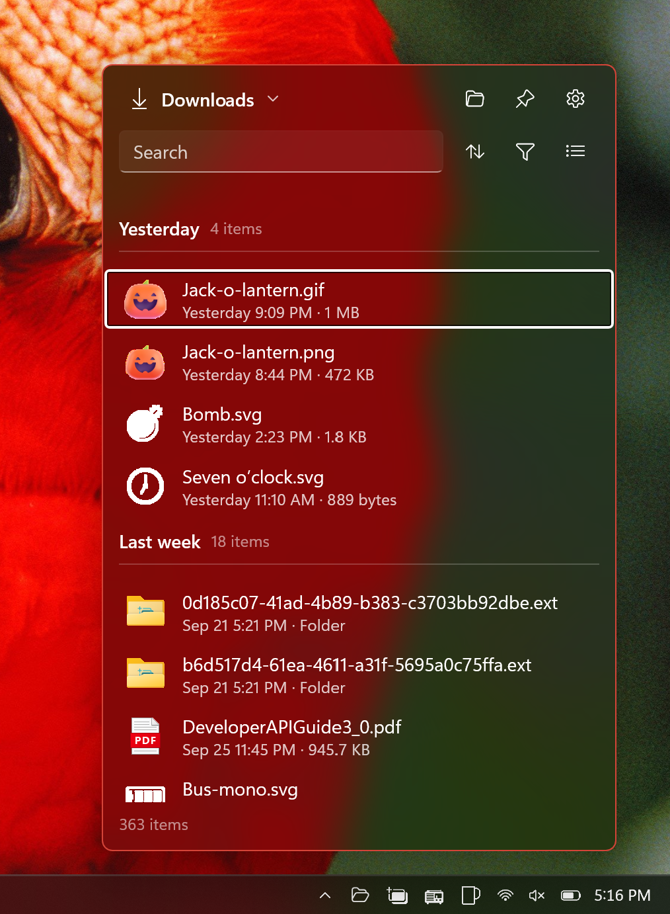

# Tray Folder

**A folder in your system tray.** Click the icon and your Downloads (or any folder you pick) pops up as a flyout, so you can drag the file you just saved straight into an email, a chat or a document, without opening File Explorer.

Tray Folder is a small, tray-only WinUI 3 app for Windows 10 and 11. It has no main window. It only does work while the flyout is open.

<p align="center">
  
</p>

## Features

- **Drag files out.** Drag one or many files from the flyout into Outlook, Teams, Slack, a browser upload box, a Word document or any other drop target. Drags are copy-only, so nothing moves or gets deleted. You can also select files and press <kbd>Ctrl</kbd>+<kbd>C</kbd>.
- **Newest first.** By default the list is sorted by date modified, newest first, and grouped the way Explorer groups Downloads (Today, Yesterday, Earlier this week, and so on).
- **Pin it open.** The pin button keeps the flyout open while you drag several files, one after another.
- **Explorer-style view options.** Sort by name, date, type or size. Group by name, date, kind or size. Filter by kind (image, video, audio, document, archive, program) or by age (today, last week, month, year). Show or hide folders, hidden files and file extensions. Switch between a list and tiles.
- **Search.** Type to filter the folder as you go.
- **Real thumbnails.** Rows show the same shell thumbnails as Explorer.
- **Built-in preview.** Open a file's detail page to see an image, SVG, text file, audio or video clip, or PDF, along with its file info, without leaving the flyout. Large files fall back to info only, so a huge log or a 200 MP photo never stalls the flyout.
- **Context menu.** Preview, Open, Open with…, Copy, Copy as path and Show in File Explorer.
- **Any folder.** Point it at Downloads, a screenshots folder, a project's output folder or anywhere else. Recent folders are remembered. The tray icon's tooltip shows which folder it opens.
- **Start with Windows** (optional) so the icon is ready after you sign in.
- **Light and dark.** The tray icon and flyout follow the system theme.
- **Private and light.** The app has no network access, no accounts and no telemetry. While the flyout is hidden it does nothing: no polling and no file watcher. It reads the folder when you open the flyout and watches it only while the flyout is visible.

## Using it

| Do this | To get this |
|---|---|
| Click the tray icon | Show or hide the flyout |
| Right-click the tray icon | Open, Settings, Exit |
| Drag a row out of the list | Copy that file into whatever you drop it on |
| Right-click a row | Preview, Open, Open with…, Copy, Copy as path, Show in File Explorer |
| <kbd>Esc</kbd> | Step back: detail or settings to the list, then clear the search, then hide the flyout |

## Install

Signed MSIX packages (x64 and ARM64) are published on the [Releases page](https://github.com/Tray-Land/tray-folder/releases). Download the one for your machine and open it.

## Build from source

You need Windows 10 (1809) or later, the .NET 10 SDK, and **Developer Mode** turned on (Settings → System → For developers).

```powershell
git clone https://github.com/Tray-Land/tray-folder.git
cd tray-folder

# Build and run with package identity. The winapp integration registers a loose-layout package for you.
dotnet run -c Debug -p:Platform=x64      # use ARM64 on Arm machines

# Test first-run behaviour with a clean slate
winapp run .\bin\x64\Debug\net10.0-windows10.0.26100.0 --clean
```

The app must run with package identity, so use `dotnet run` or `winapp run` and don't launch the exe directly. If an old instance is still running, `taskkill /IM TrayFolder.exe /F` before relaunching.

### Tests

The sort, filter and group logic is pure and has no WinRT dependency, so it runs in a plain `net10.0` test project:

```powershell
dotnet test TrayFolder.Tests
```

### Releasing

`build-msix-for-gh.ps1` builds and signs the MSIX packages for each platform, verifies the signatures, tags the commit and creates a **draft** GitHub release for you to review and publish. Signing uses a local `sign-msix` profile function that lives outside this repo. Use `-SkipRelease` to build and sign only.

## How it's built

| | |
|---|---|
| UI | WinUI 3 on Windows App SDK 2.5, [WinUIEx](https://github.com/dotMorten/WinUIEx) for windowing |
| Runtime | .NET 10, `net10.0-windows10.0.26100.0`, x64 and ARM64 |
| Packaging | MSIX, built and run with the [`winapp` CLI](https://github.com/microsoft/WinAppCli) |
| Native calls | [CsWin32](https://github.com/microsoft/CsWin32), plus raw vtable calls for shell thumbnails |

```
App.xaml.cs        Tray icon, single instance, and the only exit path (no main window)
Views/             TrayFlyoutWindow hosts FlyoutPage (list), DetailPage (preview + info), SettingsPage
Core/              Pure logic: FolderViewPolicy (sort/filter/group), FileKinds, view options
Services/          Folder reading and watching, drag data, shell thumbnails, settings (JSON), startup, placement
Models/            FileItem and FileGroup, the UI-facing rows
TrayFolder.Tests/  Unit tests for Core
```

A few design choices worth knowing about:

- **Dragging can't await.** Rows resolve their `StorageItem` ahead of time (on thumbnail load, pointer press and selection) so the drag data can be filled in synchronously.
- **Shell calls stay off the UI thread.** Calling them inside layout callbacks pumps messages and XAML fails fast with a reentrancy error.
- **The flyout cleans up after itself.** It is hidden on dismiss and closed after a minute hidden. Anything it starts, it stops in `OnHidden` or `Dispose`.
- **Trim-safe COM.** `ShellThumbnail` avoids `[ComImport]` because trimmed Release builds drop built-in COM marshalling.

See [`CLAUDE.md`](CLAUDE.md) and [`AGENTS.md`](AGENTS.md) for the full conventions used when working in this repo.

## License

[MIT](LICENSE) © 2026 Joseph Finney
